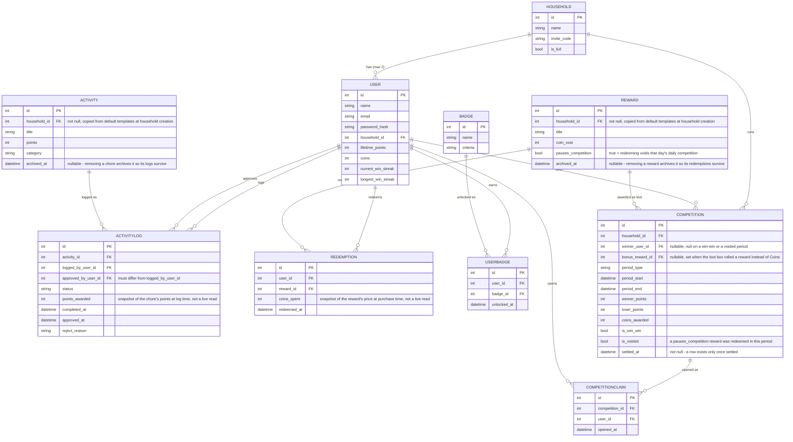

# ER diagram draft

Generated by Claude Sonnet 5, prompt: according to 3 ER diagram SVGs, generate an er diagram md file that can be processed by AI and rendered on github, and a relational model md file.

Notes on reading this against the three split diagrams:

- Mermaid's crow's-foot notation (`||--o{`) reads as "one required, many optional" — e.g. `HOUSEHOLD ||--o{ USER` means one household relates to zero-or-many users (the "max 2" business rule isn't expressible in crow's-foot and is called out in the label instead, same as it's enforced in application code, not a database constraint — see `relational-model.md`).
- The two relationships between `USER` and `ACTIVITYLOG` (`logs`, `approves`) are drawn as two separate lines here, whereas the split diagram simplified `approves` to a labeled foreign key to keep that one diagram readable. Both are correct descriptions of the same schema; use whichever is clearer for a given conversation.
- If a static image is needed (for the submission video or a place that can't render Mermaid), paste the block into the [Mermaid Live Editor](https://mermaid.live) and export SVG/PNG from there — that avoids hand-placing 9 entities' worth of coordinates by hand, which is the failure mode a single hand-drawn SVG would hit.
